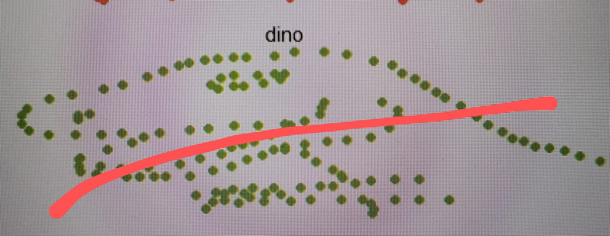

```{r setup, include=FALSE}
knitr::opts_chunk$set(echo = TRUE)
```

## R Markdown

This is an R Markdown document. Markdown is a simple formatting syntax for authoring HTML, PDF, and MS Word documents. For more details on using R Markdown see <http://rmarkdown.rstudio.com>.

When you click the **Knit** button a document will be generated that includes both content as well as the output of any embedded R code chunks within the document. You can embed an R code chunk like this:

Este bloque de código carga las librerías necesarias para el análisis y visualización de datos: tidyverse (conjunto de paquetes útiles), datasauRus (provee el dataset), dplyr (manipulación de datos) y ggplot2 (visualización).

```{r}
library(tidyverse)
library(datasauRus)
library(dplyr)
library(ggplot2)
```

Se comienza mostrando un mensaje y luego agrupa el conjunto datasaurus_dozen por nombre de dataset. Para cada grupo calcula la media y desviación estándar de las variables x e y, además de la correlación entre ambas. Esto permite comparar estadísticamente distintos conjuntos de datos que, visualmente, pueden ser muy diferentes.

```{r}
print("Inicio del código")

datasaurus_dozen %>%
  group_by(dataset) %>%
  summarize(
    mean_x = mean(x),
    mean_y = mean(y),
    std_dev_x = sd(x),
    std_dev_y = sd(y),
    corr_x_y = cor(x,y)
  )
```


Despues se genera una visualización de todos los subconjuntos del conjunto datasaurus_dozen. Usa ggplot2 para graficar los puntos (x, y) y organiza cada conjunto en una cuadrícula con facet_wrap. Se eliminan los ejes y la leyenda para resaltar únicamente las formas de los datos en cada grupo.

```{r}
ggplot(datasaurus_dozen, aes(x=x, y=y, colour = dataset))+
  geom_point()+
  theme_void()+
  theme(legend.position = "none")+
  facet_wrap(~dataset,ncol = 3)
```


Luego filtramos el conjunto datasaurus_dozen y conserva solo las observaciones del dataset llamado "dino", que es el más representativo del conjunto por su forma de dinosaurio.

```{r}
datasaurus_dozen %>%
  filter(dataset == "dino")

```

Para la regresion se filtra el dataset "dino" y lo grafica con ggplot2, mostrando los puntos en color azul y añadiendo una línea de regresión lineal en rojo punteado. Se usa un tema minimalista y se agregan etiquetas a los ejes y al título para facilitar la interpretación.

```{r}
datasaurus_dozen %>%
  filter(dataset == "dino") %>%
  ggplot(aes(x = x, y = y)) +
  geom_point(color = "steelblue", size = 2) +
  geom_smooth(method = "lm", se = FALSE, color = "red", linetype = "dashed") +
  theme_minimal() +
  labs(
    title = "Dataset: dino con linea de regresion",
    x = "X",
    y = "Y"
  )

```

Finalmente se inserta la imagen llamada "Visual_Dino_Regression.jpg" directamente en el documento, mostrando una visualización gráfica relacionada con el dataset "dino" y su línea de regresión calculada previamente.

```{r}



```

En conslusión a pesar de tener estadísticas similares, los distintos conjuntos del datasaurus_dozen muestran formas visuales muy diferentes. Esto resalta la importancia de visualizar los datos, ya que los análisis numéricos por sí solos pueden ocultar patrones significativos. La visualización es clave para una interpretación completa.